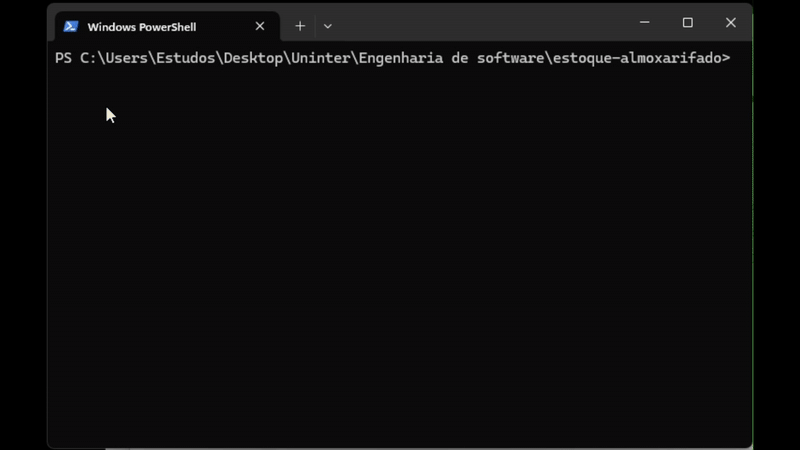

# Sistema de Controle de Estoque



**Descrição:**  
Sistema simples de console para **controle de estoque em Python**, utilizando tipagem para garantir **clareza e segurança no código**. Permite registrar **entradas e saídas de produtos**, atualizando o estoque automaticamente. Inclui **validações**, registro de **datas** e **controle de movimentações**, garantindo que o estoque reflita corretamente os itens disponíveis.  

---

## Funcionalidades

- Registrar **entrada de produtos** no estoque.  
- Registrar **saída de produtos** do estoque, validando quantidade disponível.  
- Atualizar o estoque automaticamente após cada movimentação.  
- Registrar o **responsável** e a **data** de cada operação.  
- Consultar produtos cadastrados.  
- Manter **histórico de transações**.  

---

## Requisitos do Sistema

- Python 3.8 ou superior  
- Funciona em **Windows, Linux e macOS**  
- Executado via **console/terminal**  
- Node.js (opcional) para rodar via `npm start`  

---

## Como executar

```bash
python app/main.py
